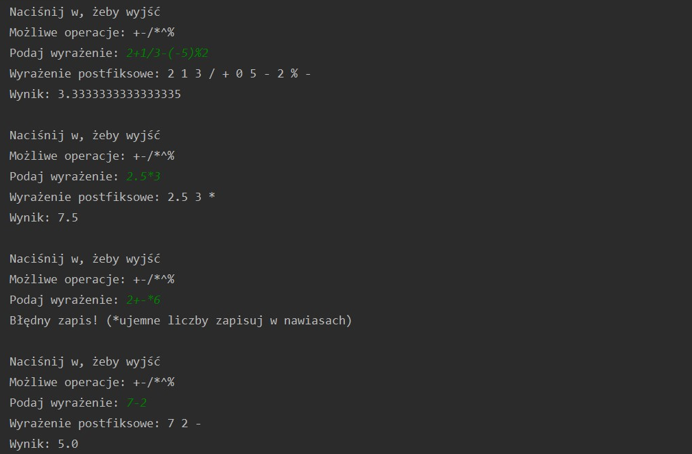

#Calculator master - Reverse Polish Notation calculator
The project created to learning the basics of Maven (includes 3 modules: implementation, interface, ui), log4j and inserting your own plugins.

###Setup:
* mvn clean install
* java -jar calculator-ui/target/calculator-ui-1.0-SNAPSHOT.jar
